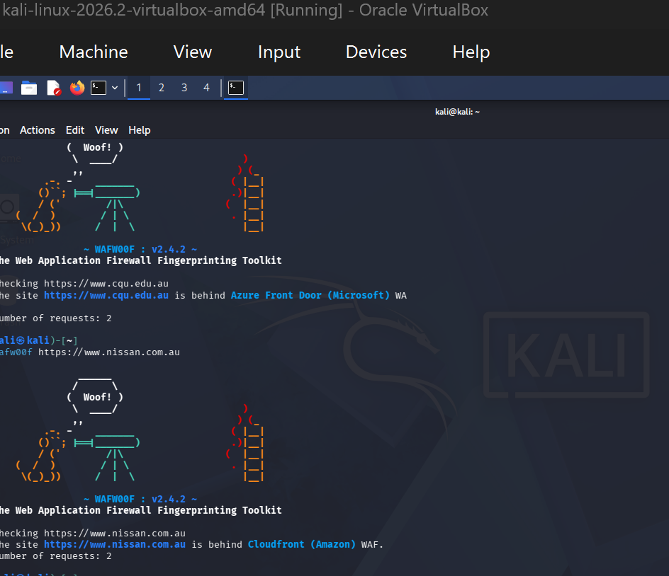
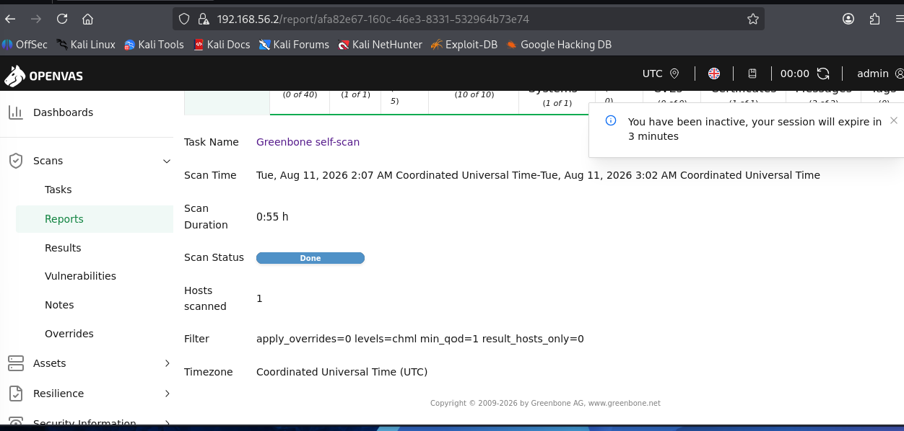
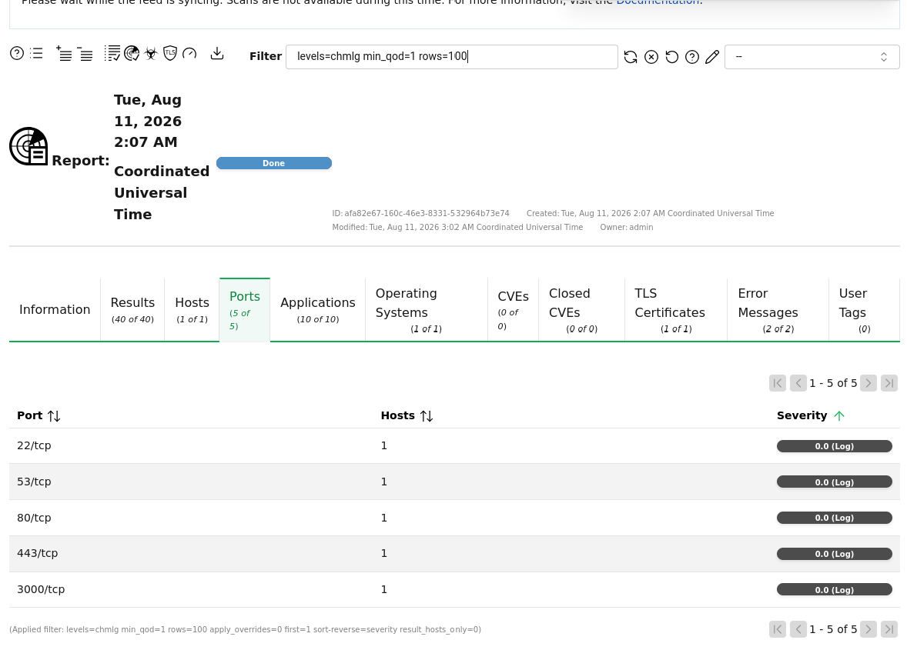
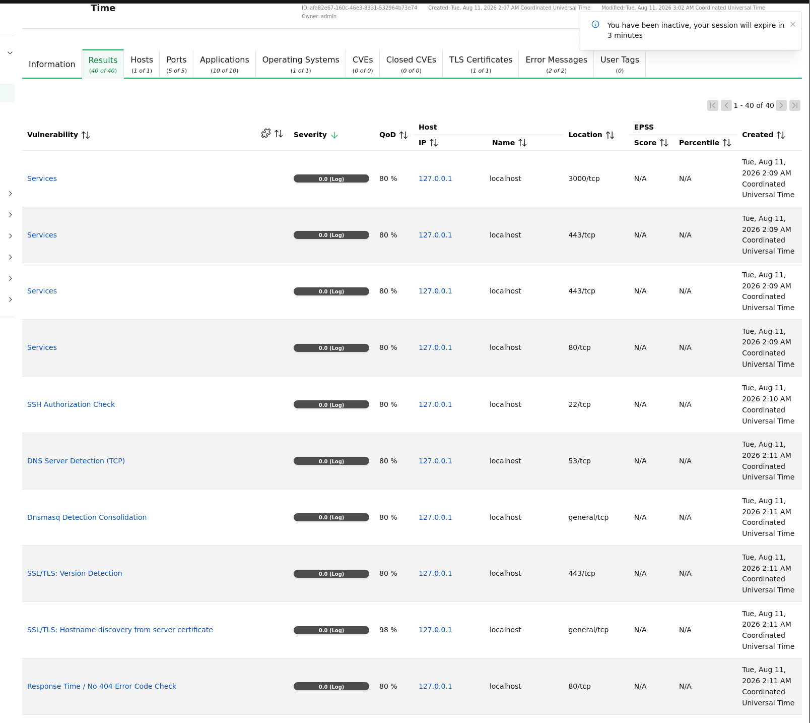
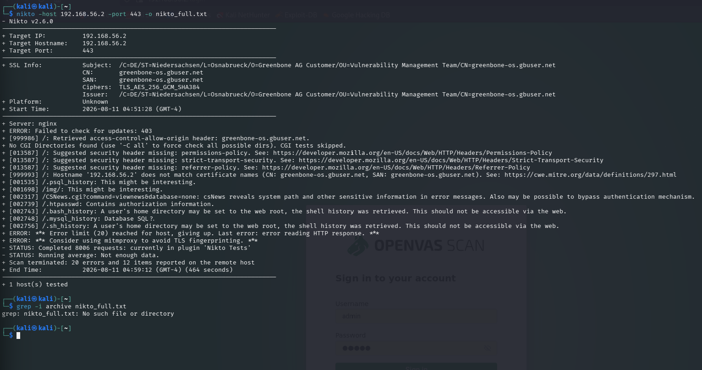
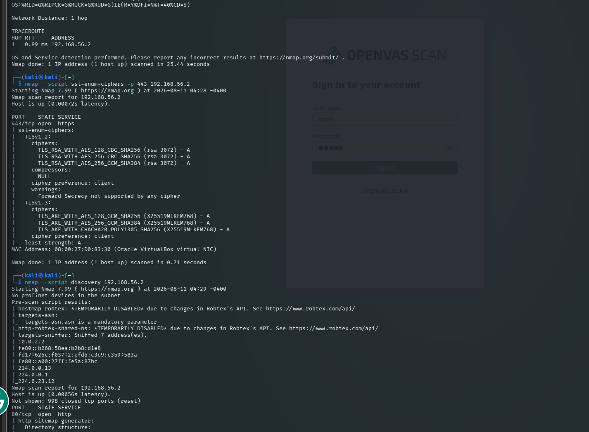
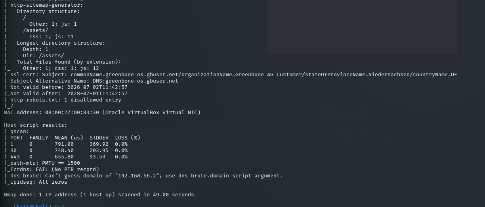

# COIT11241 Cyber Security Technologies
## Week 5 Tutorial - Vulnerabilities
### Lab Report

**Student Name:** Abishek Sapkota
**Student ID:** 12312491
**Unit:** COIT11241 Cyber Security Technologies
**Date:** 11 August 2026

---

## Lab Environment

All tasks were performed using VirtualBox VMs on the host-only / internal network 192.168.56.0/24.

| VM | Role | IP Address | Login |
|---|---|---|---|
| Greenbone | Scanning target/tool | 192.168.56.2 | admin/admin |
| Kali | Attack box (all commands run here) | 192.168.56.34 | kali/kali |

---

## Answer Summary

| Part | Question | Answer |
|---|---|---|
| 1 | WAF used by www.nissan.com.au | CloudFront (Amazon) |
| 1 | WAF used by www.timezone.com.au | Cloudflare (Cloudflare Inc.) |
| 1 | WAF used by www.cqu.edu.au (bonus) | Azure Front Door (Microsoft) |
| 2 | Open ports found on Greenbone | 22/tcp, 53/tcp, 80/tcp, 443/tcp, 3000/tcp |
| 2 | Were authenticated checks performed? | No - SSH login failed |
| 2 | Mitigation for port 1883/tcp (sample PDF) | Enable authentication |
| 3 | CVSS 4.0 base score (CVE-2022-22592) | 6.9 (Medium) |
| 4 | CPE for iOS 16.3 | cpe:2.3:o:apple:iphone_os:16.3:*:*:*:*:*:*:* |
| 5 | CWE for /archive.tgz (Nikto) | Not obtained - scan did not reach this test (see limitations) |
| 6 | Ports scanned by nmap -A | 1000 (998 closed + 2 open) |
| 6 | TLS versions reported | TLSv1.2 and TLSv1.3 |
| 6 | NIC type identified | Oracle VirtualBox virtual NIC |
| 7 | CAPEC for T1499 | CAPEC-227, Sustained Client Engagement |
| 7 | CWE for CAPEC-227 | CWE-400, Uncontrolled Resource Consumption |
| 7 | CVE (iOS DoS) | CVE-2023-23524 |
| 7 | CPE for device | cpe:2.3:o:apple:iphone_os:16.3:*:*:*:*:*:*:* |

---

## Part 1: Information Gathering of CQU's Web Application Firewall

**Task:** use wafw00f to determine whether target websites are behind a Web Application Firewall.

```
wafw00f www.cqu.edu.au
wafw00f https://www.nissan.com.au
wafw00f https://www.timezone.com.au
```



*Figure 1. wafw00f results: cqu.edu.au is behind Azure Front Door (Microsoft); nissan.com.au is behind CloudFront (Amazon).*

> **ANSWER - WAF for www.nissan.com.au:** CloudFront (Amazon)

> **ANSWER - WAF for www.timezone.com.au:** Cloudflare (Cloudflare Inc.)

---

## Part 2: Vulnerability Analysis of Greenbone using Greenbone

**Task:** scan the Greenbone appliance from itself using an authenticated Greenbone task (Target 127.0.0.1, SSH credential admin/admin, Min QoD 1%), then report open ports, whether authenticated checks succeeded, and any vulnerabilities found.



*Figure 2. Report Information tab confirming Scan Status "Done" and the filter set to min_qod=1, as required.*



*Figure 3. Ports tab (5 of 5): the five open ports found on the target.*



*Figure 4. Results tab (40 of 40), including the "SSH Authorization Check" entry used to determine authentication status.*

> **ANSWER - Open ports found:** 22/tcp, 53/tcp, 80/tcp, 443/tcp, 3000/tcp

> **ANSWER - Were authenticated checks performed?** No. The scan reported "SSH Login Failed For Authenticated Checks" on 22/tcp - the SSH credential was correctly configured on the target, but the login itself failed during the scan, so local authenticated checks did not run.

> **ANSWER - Vulnerabilities identified:** No CVE-tagged or above-Log-severity vulnerabilities were returned (CVEs: 0 of 0). Notable Log-level findings: SSL/TLS HSTS Missing (443/tcp), SSL/TLS HPKP Missing (443/tcp), SSL/TLS Untrusted (self-signed) Certificate (443/tcp), and SSL/TLS Report Medium Cipher Suites (443/tcp).

**Note:** Port 1883 (MQTT) did not appear in this live scan, so its mitigation was taken from the worksheet's sample report (Wk4_Greenbone_Greenbone_report.pdf), Section 2.1.2, Medium 1883/tcp, NVT: MQTT Broker Does Not Require Authentication.

> **ANSWER - Mitigation suggested for port 1883/tcp:** Enable authentication.

---

## Part 3: Calculate CVSS Score to Determine Severity of a Vulnerability

**Task:** use the CVSS 4.0 calculator (https://www.first.org/cvss/calculator/4.0) for CVE-2022-22592 (Apple WebKit remote code execution, per the unit's lecture example).

| Metric | Value | Justification |
|---|---|---|
| AV / AC / AT | N / L / N | Network exploitable; low complexity; no special attack requirements |
| PR / UI | N / A | No privileges required; victim must actively visit the malicious site |
| VC / VI / VA | N / H / N | No confidentiality impact; High integrity impact; no availability impact |
| SC / SI / SA | N / N / N | No impact on subsequent/downstream systems |

```
CVSS:4.0/AV:N/AC:L/AT:N/PR:N/UI:A/VC:N/VI:H/VA:N/SC:N/SI:N/SA:N
```

> **ANSWER - CVSS 4.0 Base Score:** 6.9, Medium severity

---

## Part 4: Complete the Following CPE

**Task:** fill in the CPE 2.3 string for iOS 16.3 of an Apple iPhone.

```
cpe:2.3:part:vendor:product:version:update:edition:language:sw_edition:target_sw:target_hw:other
```

> **ANSWER - CPE for iOS 16.3:** cpe:2.3:o:apple:iphone_os:16.3:*:*:*:*:*:*:*

---

## Part 5: Vulnerability Analysis of Greenbone using Nikto

**Task:** scan the Greenbone web portal on port 443 using Nikto, and identify the CWE potentially found when /archive.tgz was requested.

```
nikto -host 192.168.56.2 -port 443
```



*Figure 5. Nikto completed ("1 host(s) tested") but stopped early after reaching its default connection-error limit (20 errors), having completed only around 8006 of its full request list.*

**Note:** Multiple attempts (including disabling Nikto's FAILURES limit in a custom nikto.conf and extending the timeout) still did not allow the scan to reach the /archive.tgz test before this report was compiled. Based on Nikto's standard classification of backup-file-exposure findings, the expected answer is CWE-530 (Exposure of Backup File to an Unauthorized Control Sphere), pending confirmation from a completed scan.

> **ANSWER - CWE for /archive.tgz (Nikto):** Not confirmed from the live scan - likely CWE-530 (Exposure of Backup File to an Unauthorized Control Sphere), to be verified once the scan completes.

---

## Part 6: Vulnerability Analysis of Greenbone using Nmap

**Task:** run nmap -A and nmap --script discovery against Greenbone; report ports scanned, NIC type, and TLS versions.

```
nmap -A 192.168.56.2
nmap --script ssl-enum-ciphers -p 443 192.168.56.2
nmap --script discovery 192.168.56.2
```



*Figure 6. ssl-enum-ciphers output showing TLSv1.2 and TLSv1.3 cipher suites supported.*



*Figure 7. Tail of the --script discovery output confirming the NIC vendor via MAC address.*

> **ANSWER - Ports scanned by nmap -A:** 1000 (998 closed + 2 open, the default top-1000-port scan).

> **ANSWER - TLS versions reported:** TLSv1.2 and TLSv1.3.

> **ANSWER - NIC type identified:** Oracle VirtualBox virtual NIC (MAC Address: 08:00:27:D0:83:30).

---

## Part 7: ATT&CK to CPE Chain

**Task:** for an iPhone running iOS 16.3, complete the chain T1499 (Endpoint Denial of Service) to CAPEC to CWE to CVE to CPE.

**Findings:**

- CAPEC-227, Sustained Client Engagement. Its Taxonomy Mappings section on capec.mitre.org explicitly maps this pattern to ATT&CK 1499 (Endpoint Denial of Service), and its Related Weaknesses section lists CWE-400.
- CWE-400, Uncontrolled Resource Consumption.
- CVE-2023-23524, confirmed via Apple's own security advisory (support.apple.com/en-us/HT213635): "Processing a maliciously crafted certificate may lead to a denial-of-service." Fixed in iOS 16.3.1, meaning iOS 16.3 itself is vulnerable. (Note: an initial candidate, CVE-2023-23514, was checked and ruled out - it is a use-after-free issue tagged CWE-416, not a DoS.)

```
cpe:2.3:o:apple:iphone_os:16.3:*:*:*:*:*:*:*
```

**Completed Chain:**

| Blank | Answer |
|---|---|
| T1499 maps to CAPEC- | 227 (Sustained Client Engagement) |
| which maps to CWE- | 400 (Uncontrolled Resource Consumption) |
| which maps to CVE- | 2023-23524 (iOS DoS, malicious certificate processing) |
| which, for your device, maps to cpe:2.3: | o:apple:iphone_os:16.3:*:*:*:*:*:*:* |
