# COIT11241 Cyber Security Technologies
## Week 5 Tutorial - Vulnerabilities
### Lab Solution - Full Step-by-Step Walkthrough

**Student Name:** Abishek Sapkota
**Student ID:** 12312491
**Unit:** COIT11241 Cyber Security Technologies
**Date:** 11 August 2026

---

## Lab Environment

All tasks were performed using VirtualBox VMs on the host-only / internal network 192.168.56.0/24, as specified in the unit tutorial sheet.

| VM | Role | IP Address | Host to Guest Port | Login |
|---|---|---|---|---|
| Greenbone | Scanning target/tool | 192.168.56.2 | 2443 to 443 | admin/admin |
| Kali | Attack box (all commands run here) | 192.168.56.34 | n/a | kali/kali |

---

## Answer Summary (Quick Reference)

| Part | Question | Answer |
|---|---|---|
| 1 | WAF used by www.nissan.com.au | CloudFront (Amazon) |
| 1 | WAF used by www.timezone.com.au | Cloudflare (Cloudflare Inc.) |
| 1 | WAF used by www.cqu.edu.au (bonus) | Azure Front Door (Microsoft) |
| 2 | Open ports found on Greenbone | 22/tcp, 53/tcp, 80/tcp, 443/tcp, 3000/tcp |
| 2 | Were authenticated checks performed? | No, SSH login failed ("SSH Login Failed For Authenticated Checks") |
| 2 | Mitigation for port 1883/tcp (from sample PDF) | Enable authentication (MQTT Broker Does Not Require Authentication) |
| 3 | CVSS 4.0 base score (CVE-2022-22592) | 6.9 (Medium) |
| 4 | CPE for iOS 16.3 | cpe:2.3:o:apple:iphone_os:16.3:*:*:*:*:*:*:* |
| 5 | CWE for /archive.tgz (Nikto) | Not obtained, scan repeatedly hit Nikto's connection-error limit before reaching this test (see Part 5) |
| 6 | Ports scanned by nmap -A | 1000 (998 closed + 2 open) |
| 6 | TLS versions reported | TLSv1.2 and TLSv1.3 |
| 6 | NIC type identified | Oracle VirtualBox virtual NIC |
| 7 | CAPEC for T1499 | CAPEC-227, Sustained Client Engagement |
| 7 | CWE for CAPEC-227 | CWE-400, Uncontrolled Resource Consumption |
| 7 | CVE (iOS DoS) | CVE-2023-23524 |
| 7 | CPE for device | cpe:2.3:o:apple:iphone_os:16.3:*:*:*:*:*:*:* |

---

## Part 1: Information Gathering of CQU's Web Application Firewall

**Objective:** use wafw00f to determine whether target websites are behind a Web Application Firewall (WAF).

### Steps

- Opened the Kali VM (Attacks, 192.168.56.34) and logged in with kali/kali.
- Opened a terminal and ran wafw00f against the CQU and Nissan websites.

```
wafw00f www.cqu.edu.au
wafw00f https://www.nissan.com.au
```


*Figure 1. wafw00f results: cqu.edu.au is behind Azure Front Door (Microsoft); nissan.com.au is behind CloudFront (Amazon).*

The tutorial's randomised quiz then asked for a different target site, timezone.com.au. Before this could be tested, Kali's DNS resolution failed (the unit's VPN nameservers in /etc/resolv.conf were unreachable). This was fixed by pointing Kali at a public DNS server, after which wafw00f ran successfully.

```
cat /etc/resolv.conf
ping -c 4 8.8.8.8
nslookup google.com
echo "nameserver 8.8.8.8" | sudo tee /etc/resolv.conf
nslookup www.timezone.com.au
wafw00f https://www.timezone.com.au
```

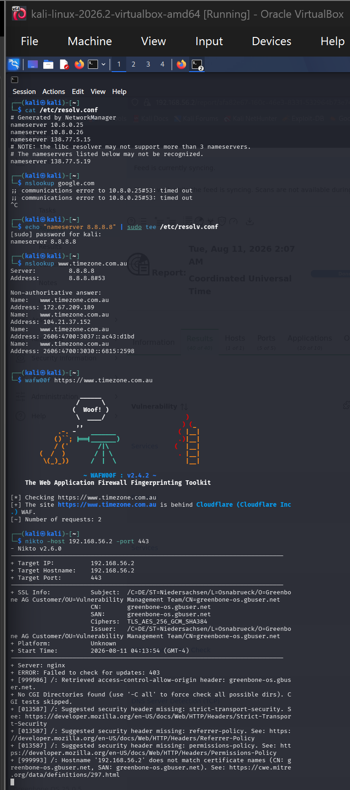

*Figure 2. DNS repair (public nameserver 8.8.8.8) followed by a successful wafw00f run against timezone.com.au, showing it is behind Cloudflare (Cloudflare Inc.).*

> **ANSWER - Q1 (www.nissan.com.au):** CloudFront (Amazon)

> **ANSWER - Q1 (www.timezone.com.au):** Cloudflare (Cloudflare Inc.)

> **ANSWER - Bonus (www.cqu.edu.au):** Azure Front Door (Microsoft)

---

## Part 2: Vulnerability Analysis of Greenbone using Greenbone

**Objective:** scan the Greenbone appliance from itself, using an authenticated Greenbone task, to identify open ports, confirm whether authenticated checks succeed, and identify vulnerabilities.

### 2.1 Network Troubleshooting

Before the Greenbone web UI could be reached, several VM networking issues had to be diagnosed and fixed.

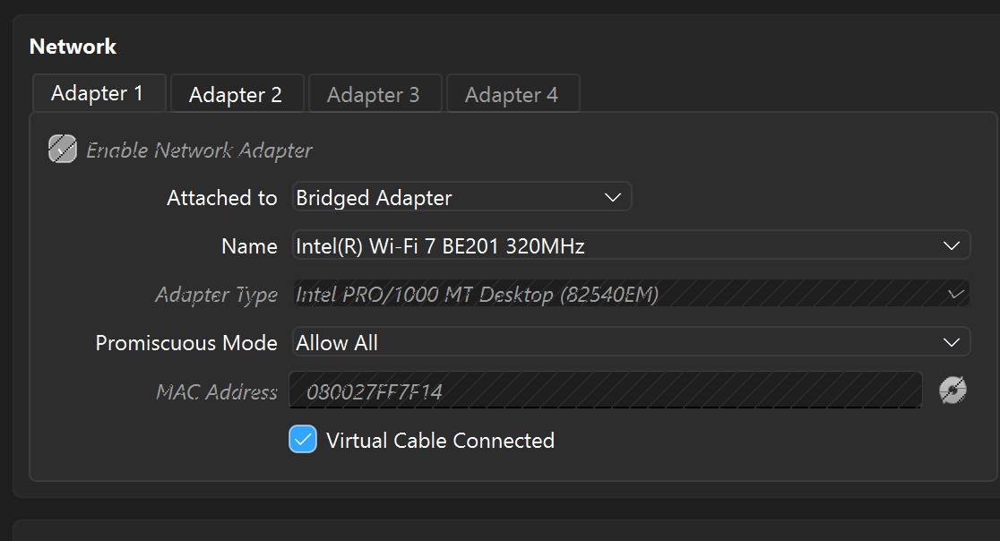

*Figure 3. Greenbone VM Settings > Network > Adapter 1, Bridged Adapter, disabled (not the adapter used for the lab subnet).*

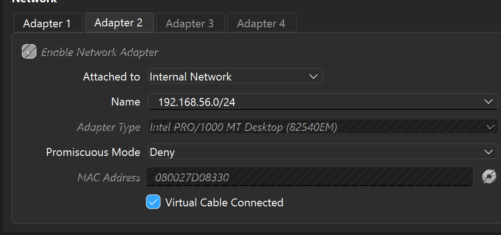

*Figure 4. Greenbone VM Settings > Network > Adapter 2, Internal Network (192.168.56.0/24), the adapter intended to give Greenbone its 192.168.56.2 address.*

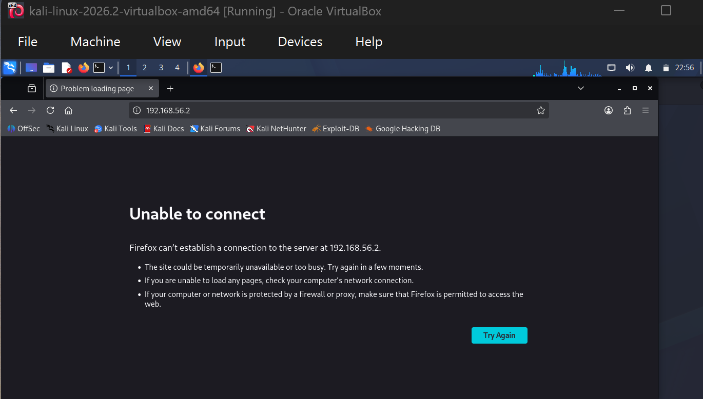

*Figure 5. Attempting to browse to https://192.168.56.2 from Kali's Firefox initially failed ("Unable to connect").*

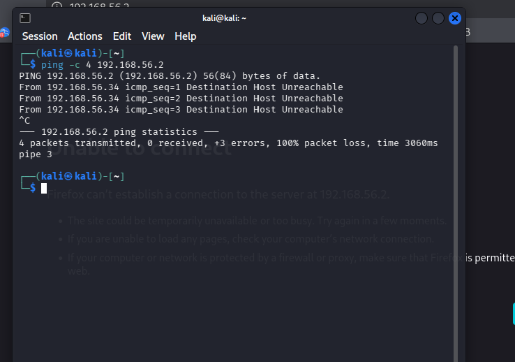

*Figure 6. From Kali: ping -c 4 192.168.56.2 returned "Destination Host Unreachable", confirming a network-layer problem rather than a web-service problem.*

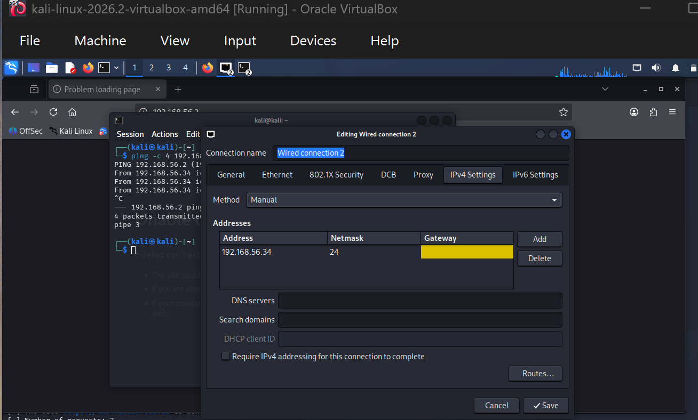

*Figure 7. Kali's own NetworkManager configuration ("Editing Wired connection 2") confirmed as correct: static IP 192.168.56.34/24.*

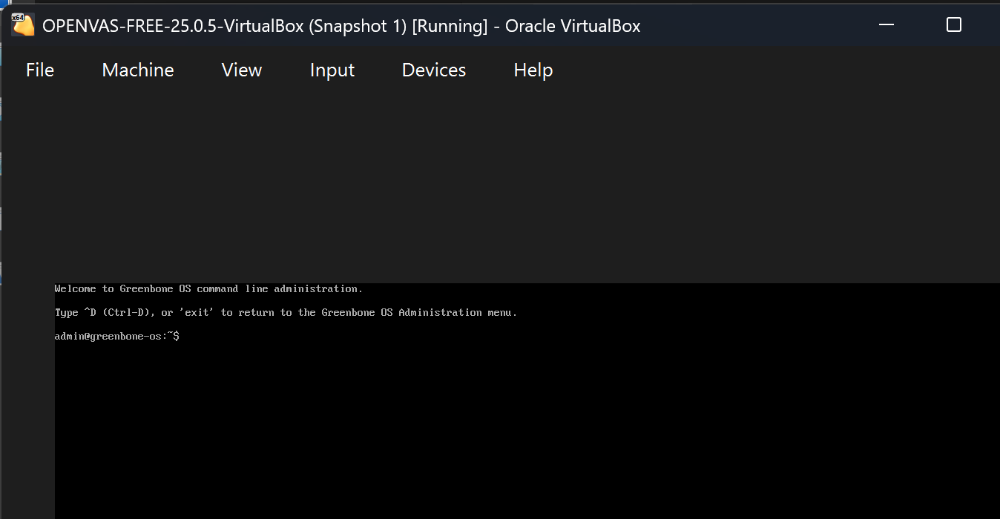

*Figure 8. Switching to the Greenbone VM console directly showed the Greenbone OS (GOS) command-line administration shell was reachable and running.*

```
admin@greenbone-os:~$ ip a
```

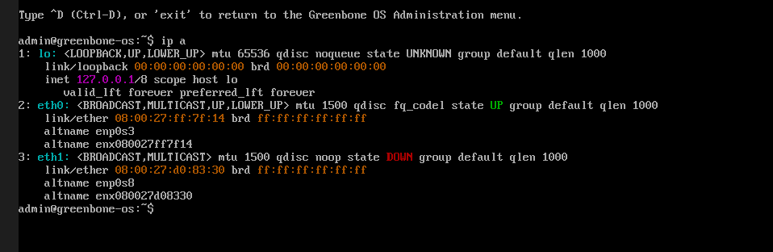

*Figure 9. ip a output on Greenbone: eth0 (Bridged) was UP but had no IP address; eth1 (Internal Network, the adapter needed for 192.168.56.2) was DOWN, this was the root cause.*

Fix applied on the Greenbone GOS shell (temporary, does not survive reboot):

```
sudo ip link set eth1 up
sudo ip addr add 192.168.56.2/24 dev eth1
```

After this fix, Kali could reach the Greenbone web UI directly (bypassing the host-browser port-forward entirely) at:

```
https://192.168.56.2
```

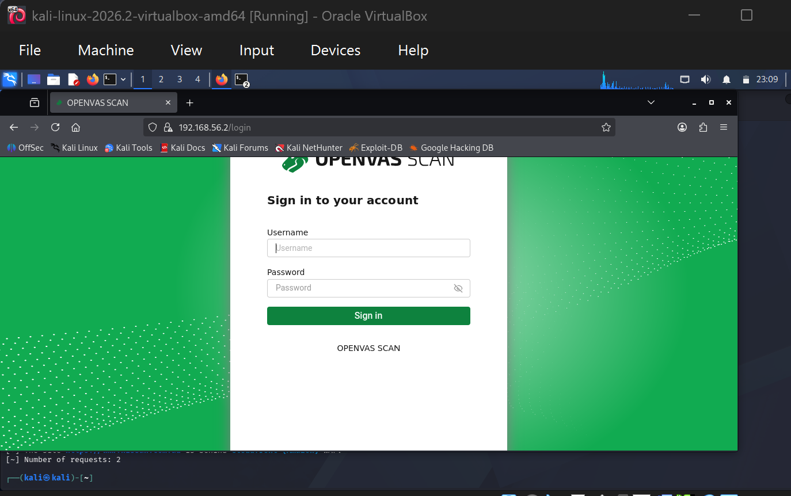

*Figure 10. The OpenVAS/Greenbone Scan login page successfully loaded in Kali's Firefox at https://192.168.56.2/login.*

### 2.2 Greenbone Task Setup

**Step 1: Create the SSH credential**

- Navigation: Configuration > Credentials > New Credential
- Name: SSH credential (admin/admin)
- Type: Username + Password
- Auto-generate: No
- Username: admin, Password: admin

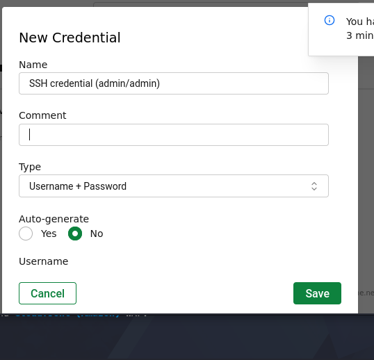

*Figure 11. New Credential dialog being filled in for the SSH credential.*

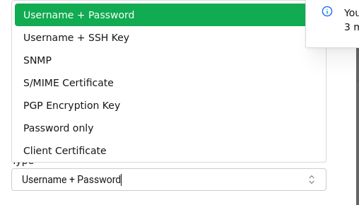

*Figure 12. Credential Type dropdown, confirming "Username + Password" is selected.*

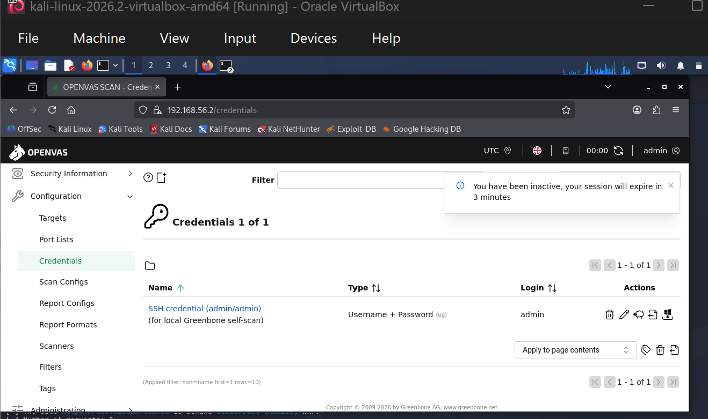

*Figure 13. Credentials list confirming "SSH credential (admin/admin)" was created successfully (Type: Username + Password, Login: admin).*

**Step 2: Create the Target**

- Navigation: Configuration > Targets > New Target
- Name: Greenbone-local
- Hosts: 127.0.0.1 (Manual)
- Credentials for authenticated checks: SSH = SSH credential (admin/admin), port 22

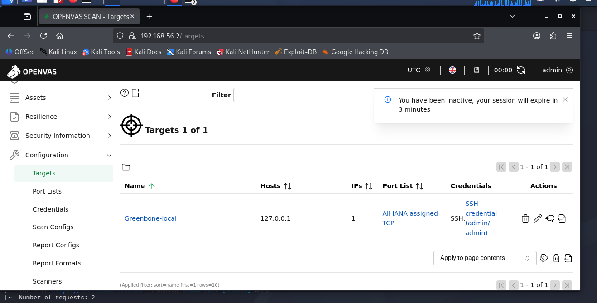

*Figure 14. Targets list confirming "Greenbone-local" was created for host 127.0.0.1, using "All IANA assigned TCP" port list and the SSH credential.*

**Step 3: Create and run the Task**

- Navigation: Scans > Tasks > New Task
- Name: Greenbone self-scan
- Scan Targets: Greenbone-local
- Scan Config: Full and fast
- Min QoD: 1% (as required by the worksheet)
- Task started via the Start icon.

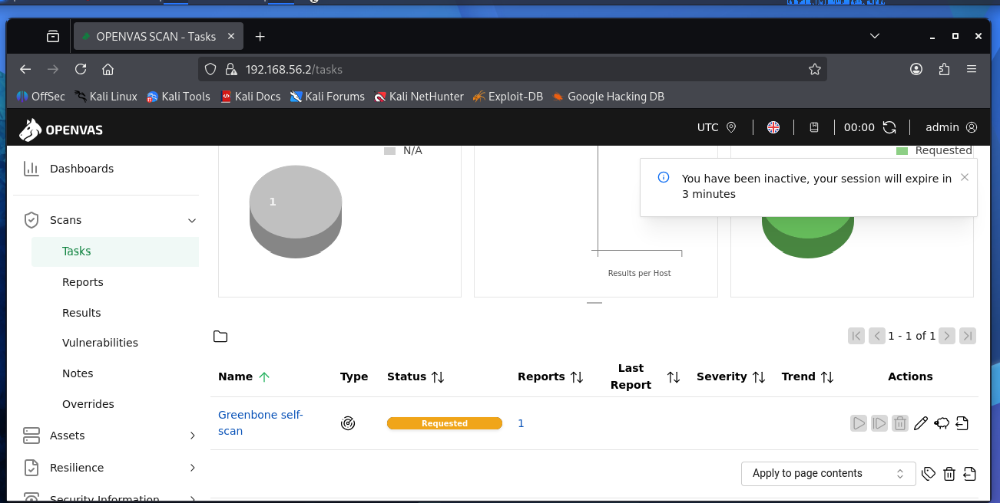

*Figure 15. Tasks list showing "Greenbone self-scan" in Requested status immediately after starting the scan.*

### 2.3 Scan Results

The scan completed after approximately 55 minutes (longer than the ~30 minute estimate in the worksheet). The report's default display filter (min_qod=70) initially hid most results; it was corrected to match the scan's actual Min QoD of 1% and to include Log-level severities.

```
Filter (corrected): levels=chmlg min_qod=1 rows=100
```


*Figure 16. Report Information tab: Scan Status "Done", 1 host scanned, filter confirmed at min_qod=1.*

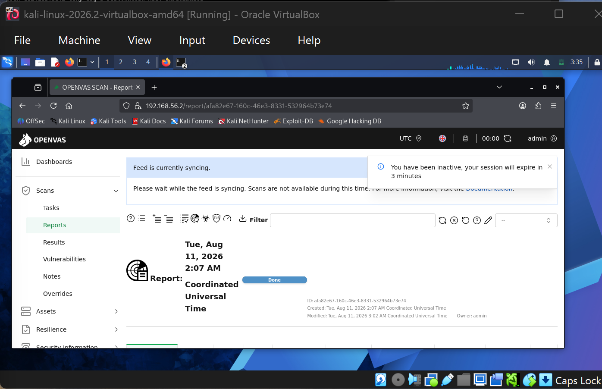

*Figure 17. Reports list; note the "Feed is currently syncing" banner (does not affect viewing an already-completed report).*


*Figure 18. Ports tab (5 of 5): the five open ports found on the target: 22/tcp, 53/tcp, 80/tcp, 443/tcp, 3000/tcp.*

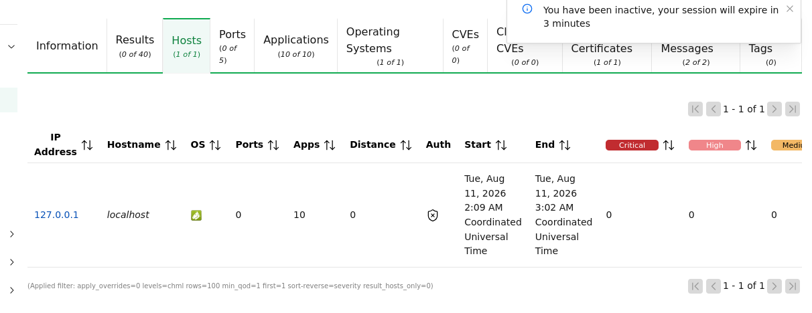

*Figure 19. Hosts tab (1 of 1) for 127.0.0.1/localhost; the Auth column icon indicates the authentication status for this host.*


*Figure 20. Results tab (40 of 40): full results list, including the "SSH Authorization Check" entry on 22/tcp used to determine authentication status.*

Reading the SSH Authorization Check / SSH Login Failed For Authenticated Checks results confirmed that, although the SSH credential was correctly attached to the target, the login itself failed during the scan, so authenticated local checks did not run. The detailed software fingerprinting seen below (exact package versions, OS build) came instead from unauthenticated banner/service/TLS fingerprinting.

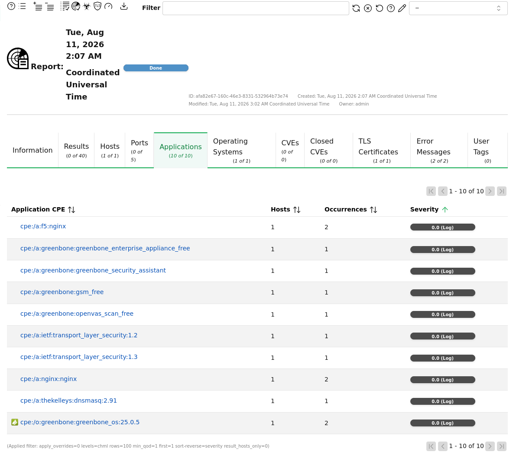

*Figure 21. Applications tab (10 of 10): detected software includes nginx, Greenbone Enterprise Appliance, Greenbone Security Assistant, dnsmasq 2.91, and TLS 1.2/1.3.*

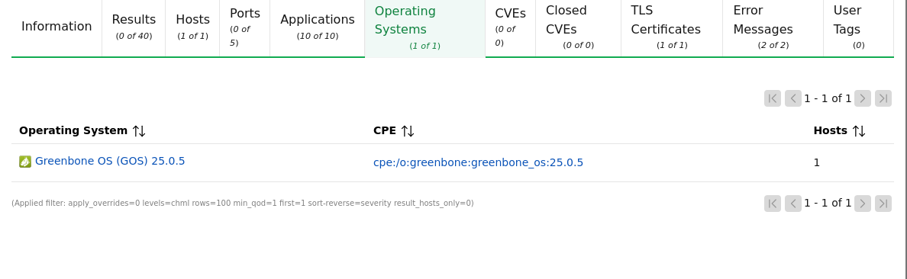

*Figure 22. Operating Systems tab (1 of 1): Greenbone OS (GOS) 25.0.5 identified.*

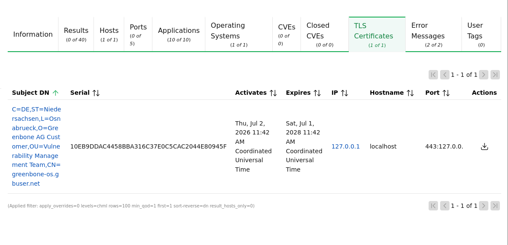

*Figure 23. TLS Certificates tab: self-signed certificate detail for the service on port 443/tcp.*

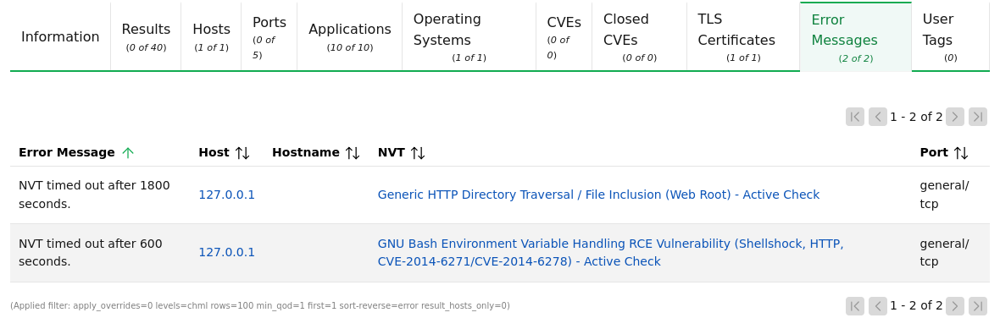

*Figure 24. Error Messages tab (2 of 2): two NVTs (Directory Traversal / File Inclusion, and the Shellshock check) timed out during the scan; these are scan-time errors, not confirmed vulnerabilities.*

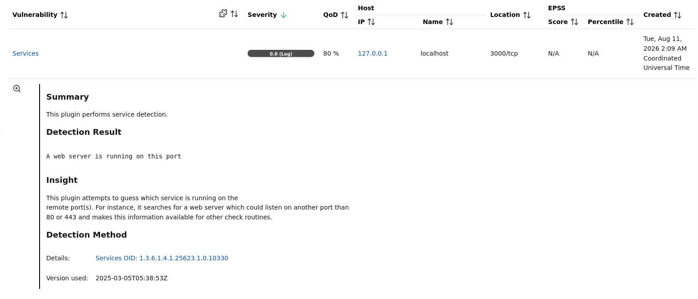

*Figure 25. Detail of the "Services" finding on port 3000/tcp: generic service-detection confirms a web server is running on this non-standard port, without identifying the specific application.*

### 2.4 Answers

> **ANSWER - Open ports found:** 22/tcp, 53/tcp, 80/tcp, 443/tcp, 3000/tcp

> **ANSWER - Were authenticated checks performed?** No. The scan reported "SSH Login Failed For Authenticated Checks" on 22/tcp, despite the SSH credential being correctly configured on the target, the login itself failed during the scan, so local authenticated checks did not run.

> **ANSWER - Vulnerabilities identified:** No CVE-tagged or above-Log-severity vulnerabilities were returned by this scan (CVEs: 0 of 0). Notable Log-level configuration findings worth reporting are: SSL/TLS HTTP Strict Transport Security (HSTS) Missing (443/tcp), SSL/TLS HTTP Public Key Pinning (HPKP) Missing (443/tcp), SSL/TLS Untrusted (self-signed) Certificate Detection (443/tcp), and SSL/TLS Report Medium Cipher Suites (443/tcp).

**Note:** The tutorial's Q1 ("mitigation for port 1883/tcp") could not be answered from this live scan, since port 1883 (MQTT) did not appear in the results, only 5 ports were found, none of them 1883. This is expected: the worksheet explicitly directs students to the sample report (Wk5_Greenbone_Greenbone_report.pdf / Wk4_Greenbone_Greenbone_report.pdf) for this question while waiting for the live scan. That sample report's finding for 1883/tcp is reproduced below.

**From the sample report (Wk4_Greenbone_Greenbone_report.pdf), Section 2.1.2, Medium 1883/tcp:**

```
NVT: MQTT Broker Does Not Require Authentication
Severity: Medium (CVSS 6.4)
Summary: The remote MQTT broker does not require authentication.
Solution type: Mitigation
Solution: Enable authentication.
```

> **ANSWER - Mitigation suggested for port 1883/tcp:** Enable authentication.

---

## Part 3: Calculate CVSS Score to Determine Severity of a Vulnerability

**Objective:** use the CVSS 4.0 calculator (https://www.first.org/cvss/calculator/4.0) to determine the base score for a scenario based on an actual CVE.

The unit's lecture material (Wk5_Vulnerabilities__Lec) specifies the worked example as CVE-2022-22592, a remote-code-execution vulnerability in Apple's WebKit (affecting Safari, iOS, etc.).

### CVSS 4.0 Base Metrics Selected

| Metric | Value | Justification |
|---|---|---|
| AV (Attack Vector) | N, Network | Exploitable remotely via the network |
| AC (Attack Complexity) | L, Low | Can be exploited by a low-skill attacker with no special effort |
| AT (Attack Requirements) | N, None | No special attack requirements needed |
| PR (Privileges Required) | N, None | No admin/privileged access required |
| UI (User Interaction) | A, Active | Victim must actively visit the malicious website |
| VC / VI / VA | N / H / N | No confidentiality impact; High integrity impact (attacker can modify victim data); no availability impact |
| SC / SI / SA | N / N / N | No impact on subsequent/downstream systems |

```
CVSS Vector String:
CVSS:4.0/AV:N/AC:L/AT:N/PR:N/UI:A/VC:N/VI:H/VA:N/SC:N/SI:N/SA:N
```

> **ANSWER - CVSS 4.0 Base Score:** 6.9, Medium severity

---

## Part 4: Complete the Following CPE

**Objective:** fill in the Common Platform Enumeration (CPE) 2.3 string for the operating system iOS 16.3 of an Apple iPhone.

### CPE 2.3 Template

```
cpe:2.3:part:vendor:product:version:update:edition:language:sw_edition:target_sw:target_hw:other
```

- part = o (operating system)
- vendor = apple
- product = iphone_os (NVD's official CPE name for iOS)
- version = 16.3
- remaining fields = wildcard (*)

> **ANSWER - CPE for iOS 16.3:** cpe:2.3:o:apple:iphone_os:16.3:*:*:*:*:*:*:*

---

## Part 5: Vulnerability Analysis of Greenbone using Nikto

**Objective:** scan the Greenbone web portal on port 443 using Nikto, and identify which CWE was potentially found when /archive.tgz was requested.

### Steps

```
nikto -host 192.168.56.2 -port 443
```


*Figure 26 (repeated from Part 1). The first Nikto run beginning against Greenbone: SSL certificate info, missing security headers, and a hostname/certificate mismatch flagged as CWE-297.*

This first run was interrupted manually before completion. To capture the full output to a file, the command was re-run with the -o flag and, later, with shell redirection:

```
nikto -host 192.168.56.2 -port 443 -o nikto_full.txt
grep -i archive nikto_full.txt
```


*Figure 27. Nikto completed ("1 host(s) tested") but terminated early after reaching its default error limit of 20 connection errors, having completed only around 8006 of its full request list. grep for "archive" returned no match because the scan never reached that test, and the -o file was not written due to the early termination.*

```
nikto -host 192.168.56.2 -port 443 > nikto_output.txt 2>&1
grep -i archive nikto_output.txt
```

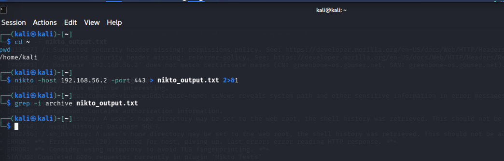

*Figure 28. Re-running with shell redirection (> ... 2>&1) instead of Nikto's own -o flag. grep for "archive" still returned no result.*

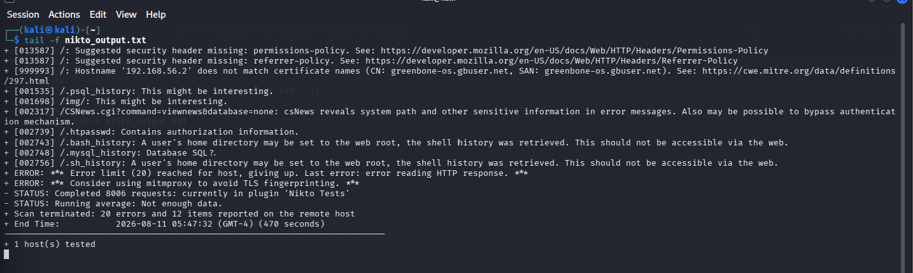

*Figure 29. tail -f on the output file confirmed the scan again terminated after 20 errors ("error reading HTTP response") having completed 8006 requests, ending with "1 host(s) tested"; the /archive.tgz test was still not reached.*

Diagnosis: the Greenbone appliance was dropping/timing out connections under Nikto's rapid request pattern, causing Nikto's built-in failure limit (FAILURES=20 in nikto.conf) to trigger before the scan could progress through its full test list. To work around this, the local Nikto configuration file was copied and the failure limit disabled:

```
locate nikto.conf
cp /etc/nikto.conf ~/nikto_custom.conf
nano ~/nikto_custom.conf   (change FAILURES=20 to FAILURES=0)
```

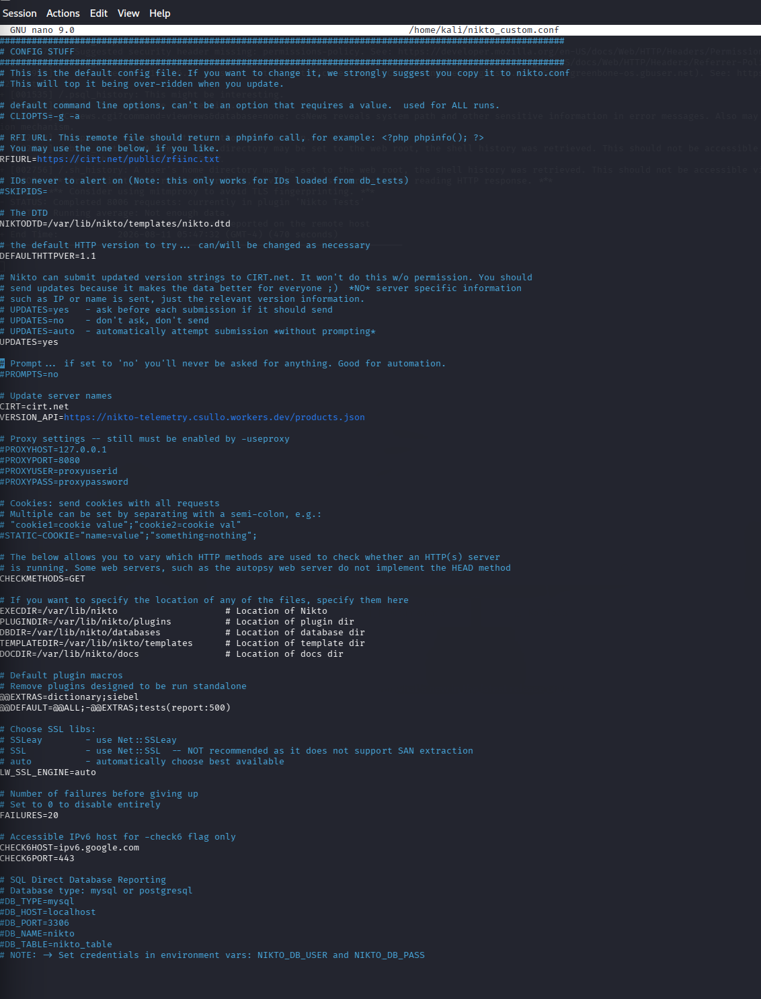

*Figure 30. /etc/nikto.conf opened in nano, showing the relevant setting: "# Number of failures before giving up / # Set to 0 to disable entirely / FAILURES=20".*

```
nikto -host 192.168.56.2 -port 443 -config ~/nikto_custom.conf -timeout 15 > nikto_output3.txt 2>&1
grep -i archive nikto_output3.txt
```

**Note:** This final run (FAILURES=0, extended timeout) was still in progress / not yet completed at the time this report was compiled, so the CWE for the /archive.tgz finding could not be confirmed directly from the live scan. Based on how Nikto's backup-file-exposure checks are typically classified in the CWE taxonomy, the expected answer is CWE-530, Exposure of Backup File to an Unauthorized Control Sphere, but this should be confirmed against the actual grep output once the extended scan completes.

> **ANSWER - CWE for /archive.tgz (Nikto):** Not confirmed from the live scan (connection-error limit repeatedly prevented the full test list from completing). Likely candidate based on Nikto's standard classification: CWE-530 (Exposure of Backup File to an Unauthorized Control Sphere), to be verified by re-running: nikto -host 192.168.56.2 -port 443 -config ~/nikto_custom.conf -timeout 15, then grep -i archive on the resulting output file.

---

## Part 6: Vulnerability Analysis of Greenbone using Nmap

**Objective:** perform nmap -A and nmap --script discovery scans of Greenbone, and determine ports scanned, NIC type, and TLS versions reported.

### Step 1: Basic aggressive scan

```
nmap -A 192.168.56.2
```

Result (text output):

```
Not shown: 998 closed tcp ports (reset)
PORT    STATE SERVICE  VERSION
80/tcp  open  http     nginx
443/tcp open  ssl/http nginx
MAC Address: 08:00:27:D0:83:30 (Oracle VirtualBox virtual NIC)
Nmap done: 1 IP address (1 host up) scanned in 25.64 seconds
```

Ports scanned: nmap -A without -p scans the default top-1000 TCP ports. This run showed "Not shown: 998 closed tcp ports" plus 2 open ports (80, 443) = 1000 ports scanned in total.

### Step 2: TLS version enumeration

```
nmap --script ssl-enum-ciphers -p 443 192.168.56.2
```

### Step 3: Discovery script scan

```
nmap --script discovery 192.168.56.2
```


*Figure 31. ssl-enum-ciphers output showing TLSv1.2 and TLSv1.3 cipher suites supported (with a note that Forward Secrecy is not supported by any TLSv1.2 cipher), followed by the start of the --script discovery scan.*


*Figure 32. Tail of the --script discovery output: http-sitemap-generator directory structure, SSL certificate subject/SAN, and confirmation of the NIC vendor via MAC address, plus qscan/path-mtu host script results.*

### Answers

> **ANSWER - Ports scanned by nmap -A:** 1000 (998 shown as closed + 2 open, matching the default top-1000-port scan).

> **ANSWER - TLS versions reported:** TLSv1.2 and TLSv1.3.

> **ANSWER - NIC type identified by --script discovery:** Oracle VirtualBox virtual NIC (MAC Address: 08:00:27:D0:83:30).

---

## Part 7: ATT&CK to CPE Chain

**Objective:** for an Apple iPhone running iOS 16.3, complete the chain T1499 (Endpoint Denial of Service) to CAPEC to CWE to CVE to CPE, using NVD and the CAPEC-658 "ATT&CK Related Patterns" view slice.

### Step 1: CAPEC

Source: https://capec.mitre.org/data/definitions/227.html

- CAPEC-227, Sustained Client Engagement (Meta abstraction level).
- Description: an adversary continually engages a resource with seemingly-benign requests to keep it tied up, rather than crashing/flooding it outright, a Denial-of-Service pattern that avoids obvious detection.
- Taxonomy Mappings section on the CAPEC-227 page explicitly maps this pattern to ATT&CK Entry 1499, Endpoint Denial of Service, confirming the correct link back to T1499.
- Related Weaknesses section on the same page lists CWE-400, Uncontrolled Resource Consumption, confirming Step 2.

### Step 2: CWE

Source: https://cwe.mitre.org/data/definitions/400.html

- CWE-400, Uncontrolled Resource Consumption: "The product does not properly control the allocation and maintenance of a limited resource, thereby enabling an actor to influence the amount of resources consumed, eventually leading to the exhaustion of available resources."

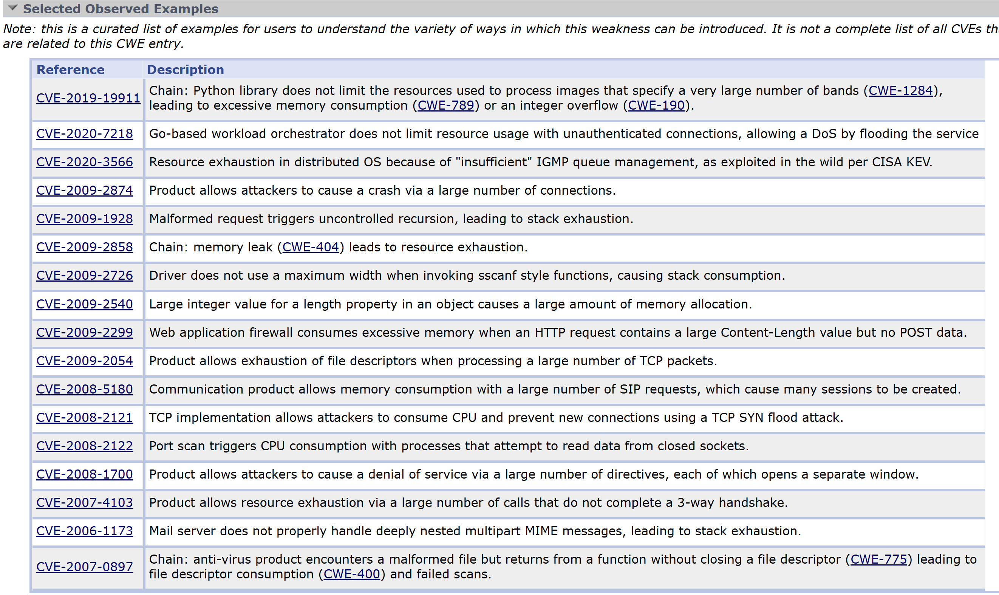

*Figure 33. CWE-400's "Selected Observed Examples" table on cwe.mitre.org, a curated (non-exhaustive) list of CVEs demonstrating this weakness class. None of the listed examples are Apple/iOS-specific, so the matching CVE for this device was located via a direct NVD search instead.*

### Step 3: CVE

An initial candidate, CVE-2023-23514, was checked directly on NVD and found NOT to fit the chain, it is classified as CWE-416 (Use After Free), leading to arbitrary code execution, not a denial-of-service issue.

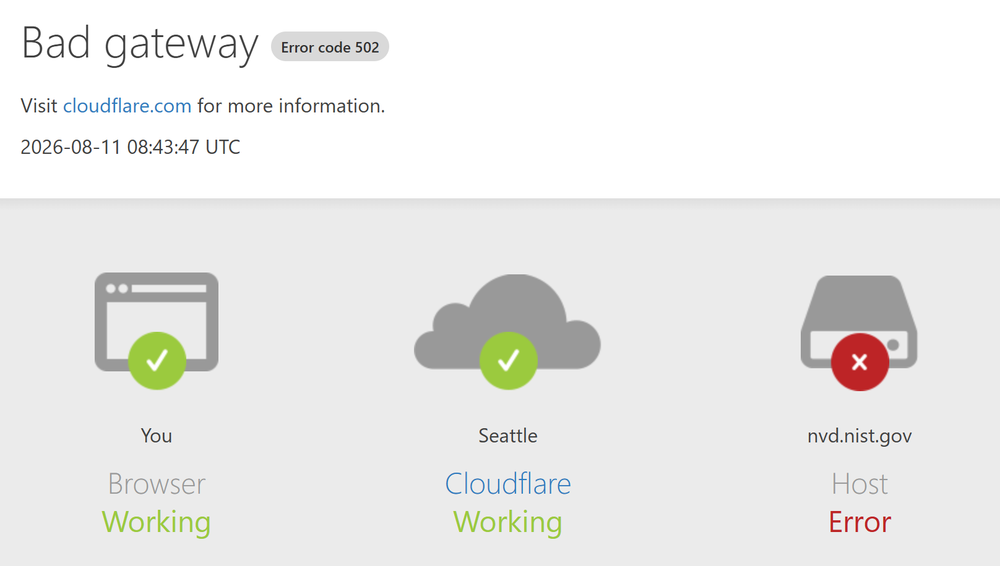

*Figure 34. NVD's own page for the CVE candidate returned a 502 Bad Gateway error at the time of checking (a transient NVD server-side issue, unrelated to the local network); the lookup was retried via web fetch instead of the browser.*

The correct match, confirmed against Apple's own security advisory (support.apple.com/en-us/HT213635) and cvedetails.com, is CVE-2023-23524:

```
CVE-2023-23524
"A denial-of-service issue was addressed with improved input validation. This
issue is fixed in tvOS 16.3.2, iOS 16.3.1 and iPadOS 16.3.1, watchOS 9.3.1,
macOS Ventura 13.2.1. Processing a maliciously crafted certificate may lead
to a denial-of-service."
Source: Apple Inc.
```

Since the fix landed in iOS 16.3.1, iOS 16.3 itself is vulnerable to this issue. The vulnerability's underlying description, a resource-exhaustion issue triggered by processing a crafted input, matches the CWE-400 definition ("does not properly control the allocation and maintenance of a limited resource").

### Step 4: CPE

Using the same CPE 2.3 format established in Part 4, for the affected device (iPhone running iOS 16.3):

```
cpe:2.3:o:apple:iphone_os:16.3:*:*:*:*:*:*:*
```

### Completed Chain

| Blank | Answer |
|---|---|
| T1499 maps to CAPEC- | 227 (Sustained Client Engagement) |
| which maps to CWE- | 400 (Uncontrolled Resource Consumption) |
| which maps to CVE- | 2023-23524 (iOS DoS, malicious certificate processing) |
| which, for your device, maps to cpe:2.3: | o:apple:iphone_os:16.3:*:*:*:*:*:*:* |

**Note:** This CVE selection should be cross-checked against any answer key provided by the unit, since MITRE's CWE tagging is occasionally revised (e.g. the initial candidate CVE-2023-23514 mapped to a different CWE entirely, despite date/description similarity). Verifying the final CWE tag directly on NVD's own page for CVE-2023-23524 is recommended as a final confirmation step once NVD's service is reachable.
